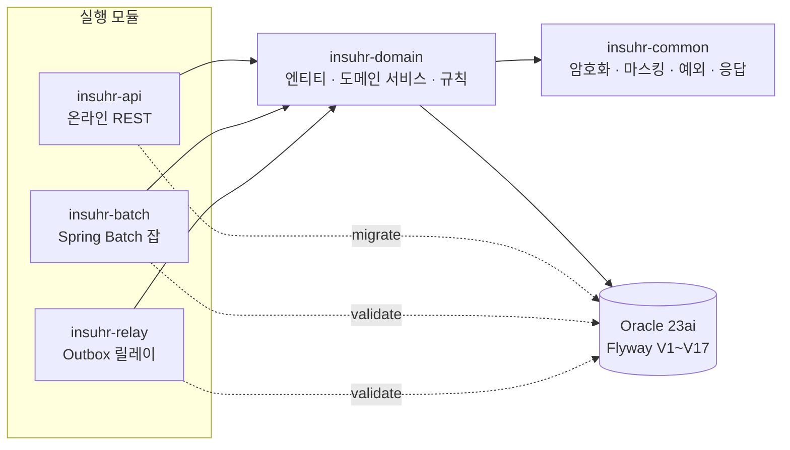
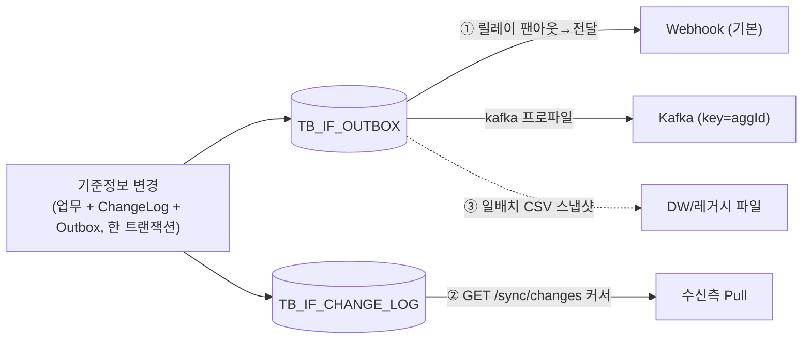

# InsuHR — 보험사 인사/설계사 관리 시스템 (포트폴리오)

보험사의 **임직원·설계사(FC) 생애주기**와 **대외 연계**를 다루는 백엔드. 설계사 위촉 상태머신, 모집자격 판정,
개인정보 통제, Transactional Outbox 기반 3계층 동기화를 실제 Oracle 위에서 구현했다.

> **이 저장소의 핵심은 코드만큼이나 [`insuhr-design-spec.md`](./insuhr-design-spec.md)와 그 [개정 이력](./insuhr-design-spec.md#개정-이력)이다.**
> 단일 설계서를 먼저 세우고, 각 Phase 구현이 설계의 허점을 실증으로 드러낼 때마다 **설계서를 개정**하며 나아갔다
> (예: 제약 위반의 rollback-only 오염 → REQUIRES_NEW, 인크리멘터가 배치 파라미터를 버리는 Boot4 실측,
> 파기 시 RRN 해시까지 지워야 재등록 부활을 막는다는 정정). 개정 이력 자체가 "설계 결정이 왜 그렇게 됐는지"의 기록이다.

## 아키텍처



- **모든 비즈니스 규칙은 `insuhr-domain`에 산다** — 상태 전이·모집자격·발령 재계산은 Controller/앱서비스가 아니라 도메인.
- 실행 모듈 3종은 **부하 격리**가 목적: 배치가 온라인을 흔들지 않고, 릴레이가 전송 I/O로 업무 트랜잭션을 잡지 않는다.
- 스키마 소유는 **api 하나만 migrate**, batch·relay는 **validate 전용**(어긋나면 기동 실패).

### 대외 연계 — 하나의 원천에서 파생되는 3계층



세 계층이 같은 Outbox/ChangeLog에서 나와 **상호 대사**가 가능하다. 이벤트 페이로드엔 **마스킹 이름·업무키만** 싣고
민감 원문은 없다(주민번호·계좌가 필요한 시스템은 Pull + 복호화 권한으로 별도 조회).

## 기술 스택

Java 21 · Spring Boot 4.1 (Framework 7) · Spring Batch 6 · Spring Kafka 4.1 · Hibernate 7 · Oracle 23ai Free ·
Flyway 12 · Gradle 9 Kotlin DSL 멀티모듈 · JUnit 6 · **Testcontainers(실제 Oracle/Kafka — H2 미사용)**.

> Boot 3→4는 프레임워크 메이저가 넷 올랐다(Security 7 · Jackson 3 · Batch 6 · Kafka 4). 무증상 회귀 지점과
> 정정은 설계서 §3.0에 실측으로 기록돼 있다.

## 빠른 시작 (10분 데모 — 위촉부터 웹훅 수신까지)

```bash
# 1) Oracle 기동
docker compose up -d oracle

# 2) API (스키마 migrate 주체) — 별 터미널
./gradlew :insuhr-api:bootRun            # http://localhost:8080/actuator/health

# 3) 릴레이 (Outbox → 웹훅) — 별 터미널
./gradlew :insuhr-relay:bootRun

# 4) 로컬 웹훅 수신 덤프 — 별 터미널
python3 demo/webhook_receiver.py         # http://localhost:9099/hook

# 5) 데모 계정 시드 (마이그레이션은 계정을 안 만든다)
docker exec -i insuhr-oracle sqlplus -S insuhr/insuhr@localhost:1521/FREEPDB1 < demo/seed.sql

# 6) 부록 B 위촉 E2E 실연
./demo/run.sh
```

`run.sh`가 로그인 → 구독자 등록 → 조직/후보 → 자격·교육·보증 → **위촉 → 협회등록(ACTIVE)** → 계좌 복호화 → 변경분 Pull을
밟고, 잠시 뒤 수신 덤프 창에 `agent.status.changed`·`agent.appointed`가 찍힌다. (Kafka로 받으려면 릴레이를
`--spring.profiles.active=kafka` + `docker compose --profile kafka up -d kafka`로.)

## 명령어

```bash
./gradlew build                          # 전체 빌드 + 테스트 (매 Phase 종료 시 그린)
./gradlew spotlessApply                  # google-java-format (build 전에)
./gradlew :insuhr-batch:test             # 배치 잡 통합 테스트
java -jar insuhr-batch/build/libs/insuhr-batch-*.jar \
     --spring.batch.job.name=eligibilityRefreshJob targetDate=2026-07-17 run.id=1
```

## Phase 지도 (설계서 §13.2)

| Phase | 내용 |
|---|---|
| 0–1 | 멀티모듈 골격, 공통코드·정책값, 계정/RBAC, 암호화·마스킹, JWT |
| 2 | 조직(이력·시점조회), 인물(주민번호 유일·복호화 접근로그) |
| 3 | 임직원·발령(**증분 아닌 재계산**), 인사기록카드, 휴가/연차 |
| 4 | 설계사 상태머신(전이표 단일 원천, 낙관적 잠금, 계보) |
| 5 | 모집자격 **판정/집행 분리**(순수 함수 + reconciler) |
| 6 | 3계층 동기화(Outbox 릴레이 2단계, Pull, 스냅샷) |
| 7 | 배치 9잡(날짜 경계 자격 전이·발령 반영·알림·정합성 리포트) |
| 8 | 개인정보 파기(익명화+대장+`person.purged`), Kafka 프로파일, 계좌 복호화 |

## 테스트

리포지토리·SQL·API·배치·릴레이 통합 테스트는 **실제 Oracle/Kafka Testcontainers + Flyway**로 돈다(H2로 검증하면
Oracle 전용 문법에 의존하는 설계라 의미가 없다). 설계서 §12의 시나리오 테스트가 사실상의 인수 기준이다.

---

*본 저장소는 포트폴리오 목적의 가상 시스템이다. 법령 의존 수치(교육 주기·보증 금액·개인정보 보존기간 등)는 전부
`TB_POLICY_CONFIG`의 가정값이며 실제 법령값이 아니다.*
